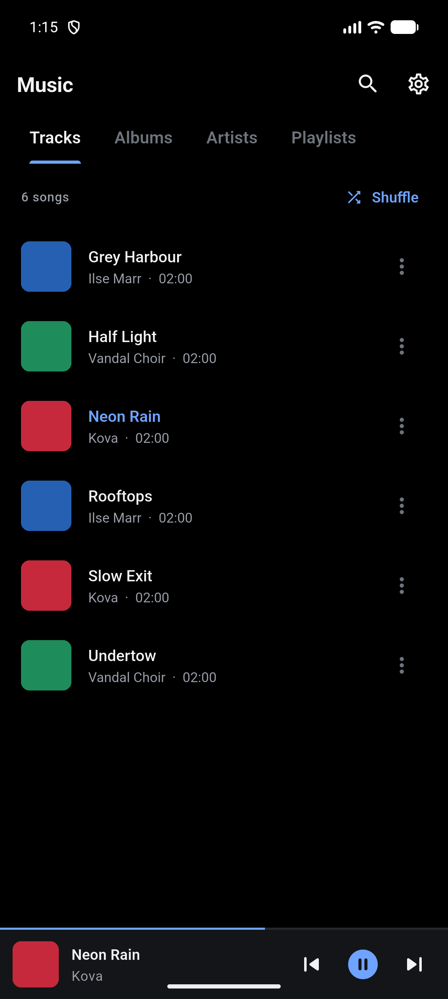
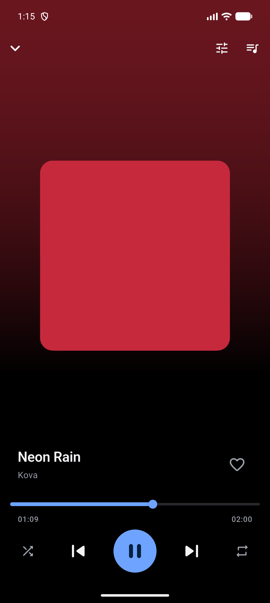
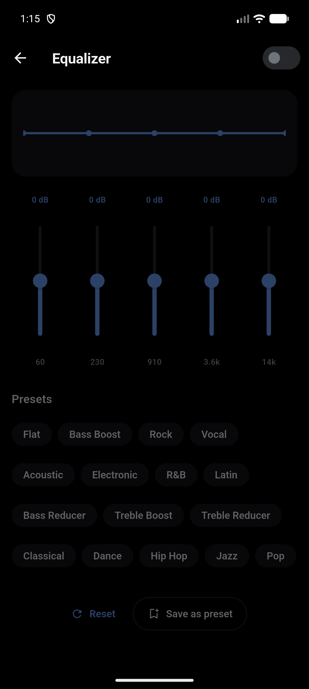
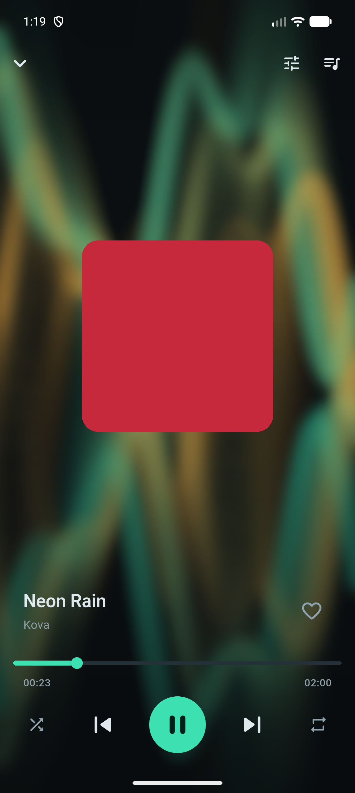

# RetroBeat

[](https://github.com/Dhiva-Labs/RetroBeat/actions/workflows/ci.yml)
[](LICENSE)
[](https://flutter.dev)

A local music player for Android, built with Flutter. It reads the music already
on your device — there is no streaming, no account, and **no network access at
all**.

The UI is One UI–inspired: a swipeable tab bar over your library, a persistent
mini player, and a full player tinted by the current album art. The look is
deliberately near-monochrome, with a single accent colour reserved for whatever
is *active* — the selected tab, the playing track, the play button.

There is also a Retro mode, which is a Windows Media Player skin with the XP-era
visualisations, because why not.

<p align="center">
  
  
  
  
</p>

## Platform support

Android is the primary target. iOS builds, and Linux/Windows/macOS run as real
desktop apps rather than a stretched-out afterthought — see [Desktop](#desktop)
below. A handful of features are Android-only, and the app says so rather than
showing controls that cannot work.

| | Android | iOS | Desktop (Linux/Windows/macOS) |
|---|---|---|---|
| Library, playback, playlists, groups | ✅ | ✅ | ✅ — folders you pick, not a system library |
| Background / lockscreen / headset controls | ✅ | ✅ (unverified) | ❌ — no OS media-session integration wired up yet |
| Equalizer | ✅ | ❌ — just_audio has no iOS equaliser (`DarwinAudioEffect` is an empty mixin) | ❌ — same reason; entry point is hidden, not shown dead |
| Retro mode + visualisations | ✅ | ✅ (procedural only) | ✅ (procedural only) |
| Audio-reactive visualiser | ✅ | ❌ — needs `android.media.audiofx.Visualizer` | ❌ — same API; hidden rather than shown dead |

## Features

- **Library** — scans device audio via MediaStore into Tracks, Albums, Artists,
  Genres, Playlists, Groups and Liked.
- **Configurable tabs** — four are shown by default (Tracks, Albums, Artists,
  Playlists); the rest are one toggle away in Settings, and all of them can be
  reordered. Tracks and Playlists cannot be hidden.
- **Background playback** — media notification, lockscreen controls, and
  headset/bluetooth buttons, via `audio_service`.
- **Equalizer** — real, applied to the audio pipeline. Presets plus per-band
  control, and you can save your own. Reachable from Settings or the player.
- **Queue** — view the current play order and drag to reorder it.
- **Swipe to change track** — on the album art or the mini player; left for
  next, right for previous.
- **Playlists and Groups** — hand-made playlists, plus groups that fill
  themselves (Favorites, Most Played, Recently Added).
- **Light and dark themes**, plus an optional **Retro mode**: a Windows Media
  Player skin with eight XP-era visualisations — three continuous flowing fields
  (Ambience, Alchemy, Plenty) that take the whole player, plus Bars, Ocean Mist,
  Scope, Battery and Fire Storm. Tap the visualiser to flick through them.

## Requirements

- Flutter 3.44+ / Dart 3.12+
- Android `minSdk 24`, `compileSdk 36` (inherited from the Flutter Gradle plugin)
- iOS 13.0+

## Getting started

```bash
flutter pub get
flutter run
```

Tests and static analysis:

```bash
flutter analyze
flutter test
```

### Building

```bash
# Sideloadable APK
flutter build apk --release --split-per-abi

# Play Store bundle
flutter build appbundle --release
```

Release builds run R8. **Test a release build on a real device before shipping** —
shrinker breakage never appears in debug. See [RELEASING.md](RELEASING.md) for
signing, versioning and the Play Store checklist.

## Desktop

Linux, Windows and macOS run the same UI stretched onto a resizable window,
backed by a genuinely different library and playback pipeline underneath —
there is no MediaStore to query outside Android. Instead, Settings → Folders
(or the button on an empty library) opens a native folder picker, and
everything found under it is scanned recursively for `.mp3`, `.m4a`, `.aac`,
`.flac`, `.wav`, `.ogg` and `.opus`, tags and embedded art included.

```bash
flutter run -d linux     # or windows / macos
flutter build linux --release
flutter build windows --release
flutter build macos --release
```

**Linux** needs `libmpv` at runtime — playback goes through
`just_audio_media_kit` over libmpv, and unlike Android there is no bundled
decoder to fall back on:

```bash
sudo apt install libmpv2    # Debian/Ubuntu
sudo dnf install mpv-libs   # Fedora
sudo pacman -S mpv          # Arch
```

If your Flutter install is the snap package, its own bundled `clang` is what
the linker needs at build time, not the system one:

```bash
CC=/snap/flutter/current/usr/bin/clang \
CXX=/snap/flutter/current/usr/bin/clang++ \
flutter build linux --release
```

Server credentials (for the WebDAV support) go in the OS keychain everywhere —
Keychain on macOS, DPAPI on Windows, and on Linux whatever
`flutter_secure_storage` finds via libsecret, typically gnome-keyring or
kwallet.

## Architecture

```
lib/
  core/        theme, shared widgets (Artwork, SongTile, EmptyState), utils
  data/
    models/         Hive models: Song, Playlist, Group, EqPreset
    repositories/   persistence + MediaStore queries
    services/       AudioHandler, EqualizerService, PermissionService, Storage
  providers/   Riverpod: playback, library, grouping, tabs, EQ, palette
  screens/     home, library, player, playlist, group, equalizer, settings
```

State is Riverpod; persistence is Hive. Screens take their colours from
`Theme.of(context).colorScheme` — never from a hardcoded constant, since that is
what previously made light mode impossible.

## Notes on the tricky parts

**The equalizer is device-driven.** It runs through just_audio's
`AndroidEqualizer` inside an `AudioPipeline`. The number of bands, their centre
frequencies, and the supported gain range are all reported by the device — they
are not ours to choose. Preset curves are therefore authored as 5 points and
resampled onto whatever bands the hardware actually exposes (see
`EqualizerService`), and gains are clamped to the device's range, with the
clamped value stored, so the sliders can never show a boost the hardware
refused.

Two consequences worth knowing:

- The equalizer cannot report its bands until playback has started, so opening
  it before playing anything shows "Play a song to use the equalizer" rather
  than a dead screen.
- Some devices support a much narrower range than others (an emulator may cap at
  ±2 dB where a phone allows ±15 dB).

**Permissions differ by Android version.** Audio access is `READ_MEDIA_AUDIO` on
API 33+ and `READ_EXTERNAL_STORAGE` below it; requesting the wrong one silently
yields no access and an apparently empty library. The real API level is read via
`device_info_plus`. If access is denied, the library shows *why* and offers a way
to grant it, rather than claiming you have no music.

**Short clips are filtered.** Anything under 30 seconds is treated as a ringtone
or notification sound and hidden. This is the "Hide short audio" setting, and
turning it off rescans immediately.

**The flowing visualisations work by frame feedback.** Ambience, Alchemy and
Plenty each draw one thin layer per frame on top of a faded, slightly zoomed copy
of the previous frame. No single frame contains the image you actually see —
only its newest layer — which is exactly why WMP's flows looked like video rather
than a redrawn chart. The buffer lives in `Visualizer`; `trailPersistenceFor`
decides how much of the last frame survives. The bar styles use no trail at all,
because a meter that never falls is not a meter.

**The visualiser has two sources, and the difference is real.** By default it is
a *procedural animation*: it moves while music plays, but it is not reading the
sound. The Settings screen says so, because a meter that looks like it is
tracking audio it never sees is a lie.

Turning on "Audio-reactive bars" switches to a genuine FFT of the playing audio,
via a native channel to `android.media.audiofx.Visualizer`. Android gates that
API behind **RECORD_AUDIO**, even though the audio being analysed is our own
playback — so enabling it triggers a microphone permission prompt. Nothing is
recorded or stored; the FFT bytes go straight to the bars and are discarded. The
permission is requested only at the moment the setting is switched on, never at
launch, and if it is denied the switch stays off rather than showing "on" above
dead bars.

**Album art is cached in a provider, not fetched in `build()`.** `on_audio_query`'s
`QueryArtworkWidget` creates its `FutureBuilder` future inside `build()`, so every
rebuild restarts the query and flashes the placeholder. Anything rebuilding on
the position tick therefore flickered continuously while playing. `artworkProvider`
fetches once and caches; see `lib/providers/artwork_provider.dart`.

## Privacy

The app collects nothing and has no network access. The one permission that looks
alarming — microphone — is optional, off by default, and exists only because
Android gates the audio-waveform API behind it. See [PRIVACY.md](PRIVACY.md).

## Not built yet

- Crossfade and skip-silence (`just_audio` supports both; not wired up)
- Home screen widgets (needs native Android widget layouts, not just Dart)
- iOS is configured but **has never been compiled or run** — see below
- Rename to "Harmony" (changes the Android `applicationId`, so an installed copy
  will not upgrade in place)
- Desktop lockscreen/media-key integration (MPRIS on Linux, SMTC on Windows,
  Now Playing on macOS) — `audio_service` is mobile-only, so `RetroBeatAudioHandler`
  runs standalone on desktop and there is no OS media session to plug it into yet

## Contributing

Issues and pull requests are welcome. CI runs `dart format`, `flutter analyze`
and `flutter test` on every push, and all three must pass. Tagged releases
(`v*`) and manual runs also build and upload Linux, Windows and macOS bundles.

Two house rules, both learned the hard way in this codebase:

1. **Colours come from `Theme.of(context).colorScheme`, never from a constant.**
   Hardcoded colours are what made the light theme impossible for so long.
2. **A control must do what it says.** This app previously shipped an equalizer
   that changed nothing, a "Dark mode" switch with no light theme behind it, and
   three menu items with no handler. If a feature cannot work on a platform, hide
   it or say so — do not render it dead.

## License

[MIT](LICENSE)
